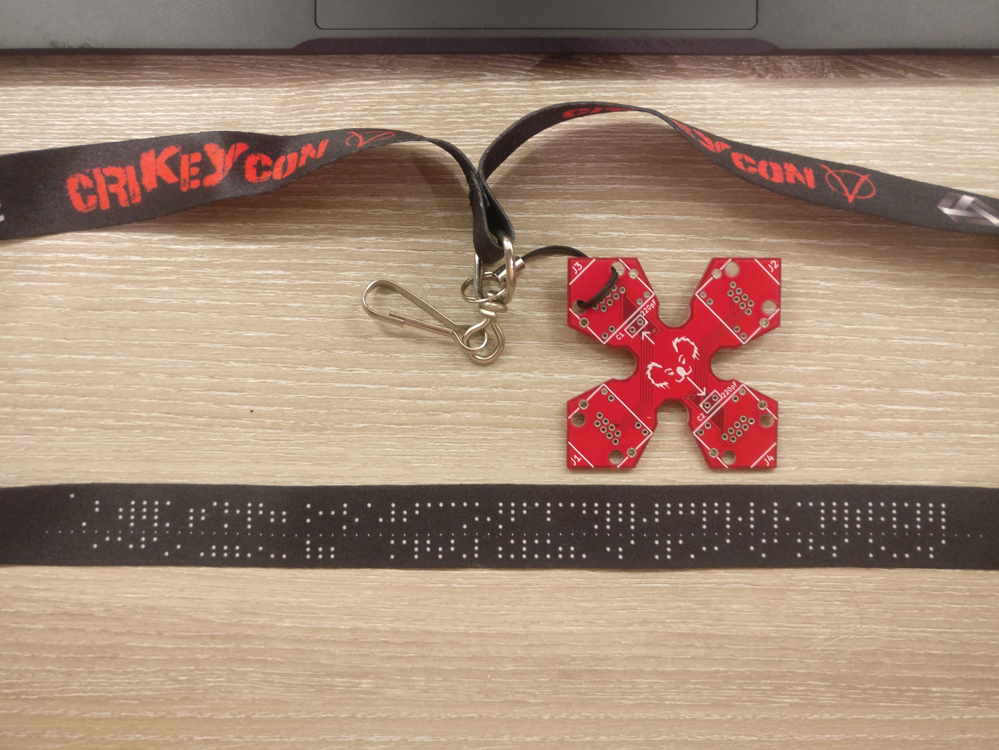

# Chapter 0: Prologue



The lanyards passed out had an intriguing pattern on the back.

Each line contains 7 bits of data along with a small alignment dot, splitting these into group of 4 bits and 3 bits per line. After the opening keynote (and my coffee had kicked in) I got straight into punching these into my phone during one of the first talks for trying different decoding schemes in the break.

If you're playing along at home, to save you the pain and tedium, here's the message in full (orientated with the 3 bit group as LSB, padded into 8 bit words).

```
01111100 01110011 01111010 01001001
01111001 01010010 01110101 00111000
01111100 01110011 01111010 01000110
01000101 00010000 01111100 00100101
01111010 00010000 01111100 01100010
01111010 01100001 01100100 01100111
01110101 00010000 01111100 01110011
01111010 01101000 01100001 01000011
01000011 01110101 01000101 01100111
01110101 01101011 00010000 01010111
01001001 01000110 01000011 01000110
01100111 00110100 01110101 00010000
01000000 00010000 01101000 00100011
00100011 01010111 00000000 00110001
00110001 01100010 01111001 00100011
01101011 01000011 00110001 00111000
00000010 01001001 01111100 01110110
01111010 00110100 00000100 01100010
00001000 01000000 00000000 00000000
```

The obvious first step was to just try a straight ASCII decode.

```
|szIyRu8|szFE|%z|bzadgu|szhaCCuEgukWIFCFg4u@h##W
```

Not ideal, although there is some recurring character sequences there. Inverting the bit order (in case I was reading it back to front) was also equally useless. Time to try and figure what this is.

After a bit of Google-fu, it was looking like it was a printing of old 7-track [punched tape media](http://www.obsoletemedia.org/punched-tape/). This confirmed the bit layout used above (LSB is the outermost of the 3 bit group), but unfortunately is appeared encoding was still 7 bit ASCII.

A little more digging unearthed some alternative schemes...


Again, no luck with these.

It's probable that the printed message may be a ciphertext (possible a [Vernam cipher](https://en.wikipedia.org/wiki/Gilbert_Vernam#The_Vernam_cipher) due to it's relation to paper tape usage). There was no mention of keys on any other badge component, event program or other sources though. The reverse side of the lanyard also had the identical message printed so was not of use.

At this point, I was stuck. Thankfully it looked liked everyone else was too so the organisers opted to bypass step one so people could keep rolling.


Onwards to [part 1](1-the-eye.md).
