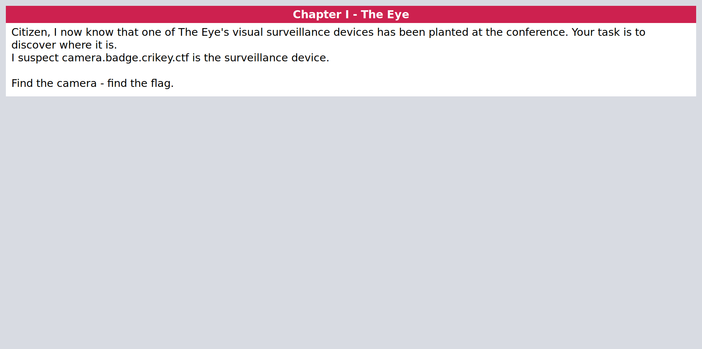
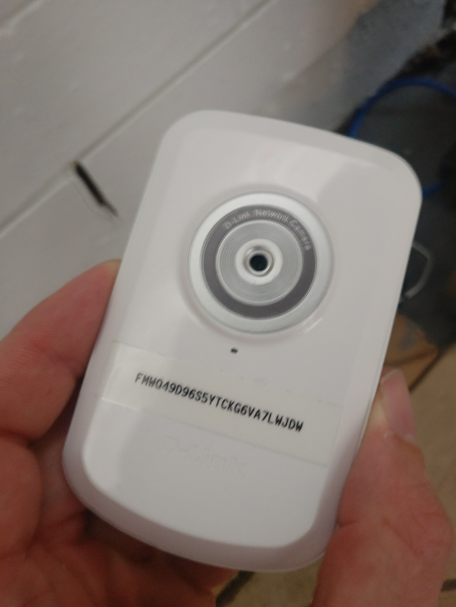

# Chapter I: The Eye

This one was a nice simple change.

Popping open that host in a browser revealed an MJPEG stream that was (presumably) live somewhere in the venue. *Sidenote for challenge organisers, delaying the feed by a couple of minutes would be a super fun way to screw with people in a challenge like this.*

The image provided very little context of location though as it was pointed at a white brick wall what looked to be behind some form of cupboard. I grabbed my laptop to provide the live feed and went for a walk.

The wall material looked similar to what was in the CTF room. I was going to try flicking the lights to confirm, but then realised that could be any easy way to piss off any entire room of CTF'ers and offensive security people so opted for some more manual searching instead.

Eventually, I found it - underneath a desk, behind some camera flight cases in the bar / food area.

That provided the 25 character string needed to access [the next chapter](2-the-ear.md).
